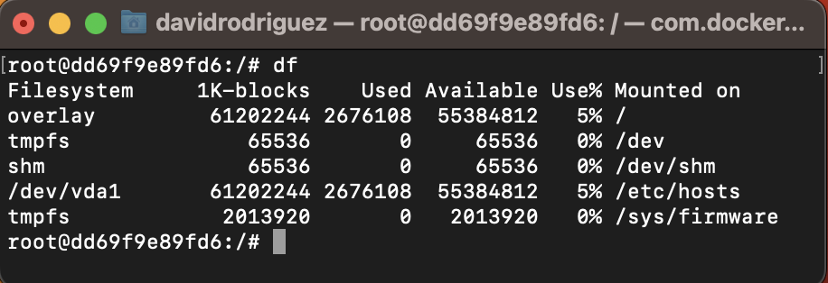
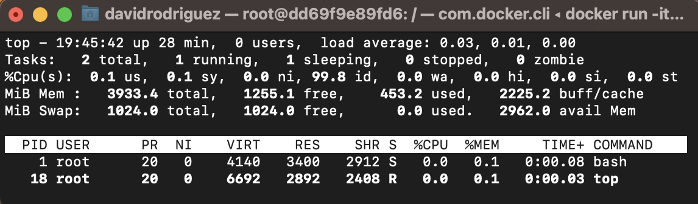
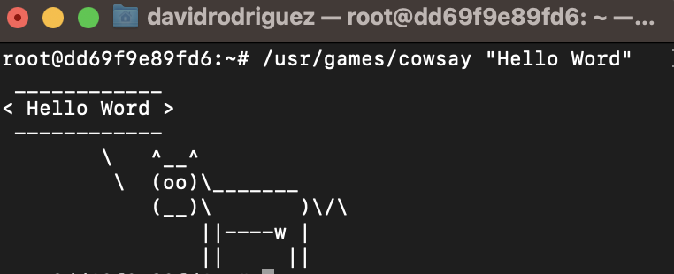

## Introducción a Docker

> En esta actividad decidí utilizar Docker en lugar de VirtualBox.

[Get Docker](https://docs.docker.com/get-docker/)

- `docker --version`: Ver versión de Docker
- `docker info`: Este comando muestra información de todo el sistema con respecto a la instalación de Docker
- `docker run -it ubuntu` (lo corre y entro al shell de ubuntu)
- `cat /etc/lsb-release` ← Propio de UBUNTU. (Ver versión )
   
   
- `df`: El comando df se usa para mostrar la información relativa al espacio total y disponible de un sistema de archivos
  
   
   
- `top`: El comando top te permite ver las tareas del sistema que se ejecutan en tiempo real
  
   
   
- `apt-get update && apt-get install -y cowsay`: Instalar los paquetes de "cowsay"

- `/usr/games/cowsay "Hello Word"`: Ejecutar paquete cowsay con texto "Hello Word"
  
