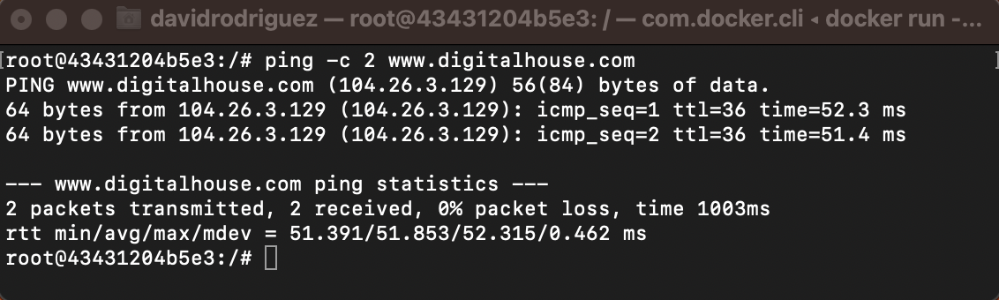
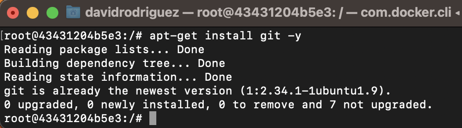
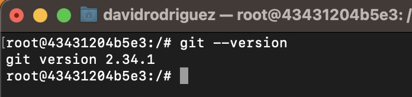

## Install Git

- Lo primero que debemos hacer es verificar que tengamos conexión a Internet, para esto utilizaremos el comando `ping`:
  

* Ahora procedemos a instalar Git a través del comando: `apt-get install git -y`
  

* Luego probamos que Git haya sido instalado a través del comando `git --version`
  

## ¿Questionario?

- ¿Por qué un lenguaje de programación sólo puede utilizarse en algunos sistemas operativos y en otros no?.  
  R: _Los lenguajes de programación están diseñados para funcionar en un entorno específico, lo que implica que su implementación y compatibilidad dependen de las características y funcionalidades proporcionadas por el sistema operativo correspondiente._

- ¿Qué tipo de máquina virtual es virtualBox?.  
  R: _Utiliza una máquina virtual de tipo 2, también conocida como hipervisor de software, que se ejecuta sobre un sistema operativo hospedador._

- Si tengo más de una máquina virtual instalada, y una se rompe, ¿esto afecta a las demás? ¿por qué?
  R: _No, una máquina virtual rota no afecta a las demás debido a su ejecución aislada y asignación de recursos individuales._
